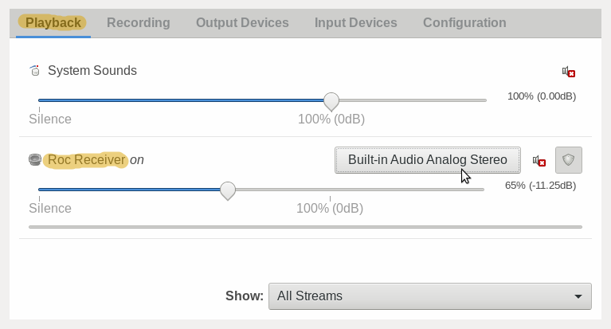
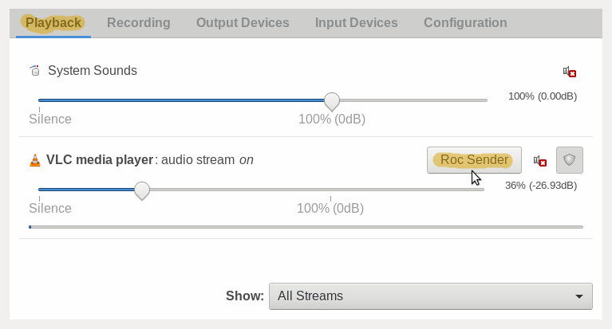

# PulseAudio modules for Roc Toolkit

[](https://github.com/roc-streaming/roc-pulse/actions) [](https://github.com/roc-streaming/roc-pulse/releases) [](https://app.element.io/#/room/#roc-streaming:matrix.org)

<!-- toc -->

- [What is this?](#what-is-this)
- [Build instructions](#build-instructions)
- [Running receiver](#running-receiver)
- [Running sender](#running-sender)
- [Setting source or sink name](#setting-source-or-sink-name)
- [Interoperability](#interoperability)
- [Troubleshooting](#troubleshooting)
- [Authors](#authors)
- [License](#license)

<!-- tocstop -->

## What is this?

This repo provides a set of PulseAudio modules enabling it to use [Roc Toolkit](https://github.com/roc-streaming/roc-toolkit) as a network transport and improve its service quality over an unreliable network such as Wi-Fi.

Advantages over Roc command-line tools:

- Seamless integration into the PulseAudio workflow. The user can connect a local audio stream to a remote audio device using common PulseAudio tools like pavucontrol.

- A bit lower latency. Since Roc is integrated into the PulseAudio server, there is no additional communication step between Roc and PulseAudio server.

Advantages over PulseAudio "native" protocol:

- Better service quality when the latency is low and the network is unreliable. PulseAudio "native" protocol uses TCP, while Roc uses RTP, which is better suited for real-time communication than TCP-based protocols.

- Compatibility with standard protocols. PulseAudio "native" protocol is PulseAudio-specific, while Roc implements a set of standardized RTP-based protocols.

Advantages over PulseAudio built-in RTP support:

- Better service quality when the latency is low and the network is unreliable. PulseAudio uses bare RTP, while Roc also employs Forward Erasure Correction extensions.

## Build instructions

### Simple build

When using this method, CMake will automatically download and build dependencies (Roc Toolkit, PulseAudio, libtool). Roc will be statically linked into the modules and there is no need to install it into the system.

First install build tools and PulseAudio:

```
sudo apt install -y \
    gcc g++ \
    make \
    libtool intltool m4 autoconf automake \
    meson libsndfile-dev \
    cmake \
    scons \
    git \
    wget \
    python3 \
    pulseaudio
```

Then build PulseAudio modules:

```
make
```

And then install modules into the system:

```
sudo make install
```

### Advanced build

You can disable automatic downloading of dependencies and build them manually.

First, download, build and install Roc Toolkit into the system as described on [this page](https://roc-streaming.org/toolkit/docs/building/user_cookbook.html).

Then download and unpack PulseAudio source code [from here](https://freedesktop.org/software/pulseaudio/releases/). There is no need to configure and build it, only source code is needed.

> Note: PulseAudio doesn't provide official API for out-of-tree modules. This is the reason why we need full PulseAudio source code to build modules.

> Note: PulseAudio source code should have **exactly the same version** as the actual PulseAudio daemon which will be used to load modules.

Optionally, download and unpack [libtool](https://gnu.askapache.com/libtool/). As with PulseAudio, there is no need to build it. Alternatively, install it into the system using your package manager.

Then you can build and install modules:

```
mkdir build/x86_64-linux-gnu
cd build/x86_64-linux-gnu
cmake ../.. \
  -DDOWNLOAD_ROC=OFF \
  -DDOWNLOAD_PULSEAUDIO=OFF \
  -DDOWNLOAD_LIBTOOL=OFF \
  -DPULSEAUDIO_DIR=<...> \
  -DPULSEAUDIO_VERSION=<...>
make VERBOSE=1
sudo make install
```

Don't forget to specify correct `PULSEAUDIO_VERSION`!

If you've installed Roc Toolkit to non-standard directory, you can use `-DROC_INCLUDE_DIR=<...>` and `-DROC_LIB_DIR=<...>`. If you want to use custom libtool instead of the one from system, you can use `-DLIBTOOL_DIR=<...>`.

### Cross-compilation

For simple cases, you can do everything automatically by specifying just two environment variables:

```
TOOLCHAIN_PREFIX=<...> PULSEAUDIO_VERSION=<...> make
```

For more granular configuration, you can invoke CMake directly:

```
mkdir build/cross
cd build/cross
cmake ../.. -DTOOLCHAIN_PREFIX=<...> -DPULSEAUDIO_VERSION=<...>
make VERBOSE=1
```

Commands above will cross-compile PulseAudio modules, as well as download and cross-compile their dependencies. Dependencies will be statically linked into modules. Modules will be installed into `./bin`.

In these commands, `TOOLCHAIN_PREFIX` defines toolchain triple of the target system, e.g. `aarch64-linux-gnu`. In this case `aarch64-linux-gnu-gcc` and other tools should be available in `PATH`.

For more complicated cases, refer to [standard instructions](https://cmake.org/cmake/help/latest/manual/cmake-toolchains.7.html) for cross-compiling using CMake.

### Prebuilt toolchains

You can use one of our docker images with prebuilt cross-compilation toolchains. The commands below will cross-compile PulseAudio modules and install them to `./bin`.

Raspberry Pi (64-bit):

```
docker run -t --rm -u "${UID}" -v "${PWD}:${PWD}" -w "${PWD}" \
  rocstreaming/toolchain-aarch64-linux-gnu \
    env TOOLCHAIN_PREFIX=aarch64-linux-gnu PULSEAUDIO_VERSION=<...> make
```

Raspberry Pi 2 and later (32-bit):

```
docker run -t --rm -u "${UID}" -v "${PWD}:${PWD}" -w "${PWD}" \
  rocstreaming/toolchain-arm-linux-gnueabihf \
    env TOOLCHAIN_PREFIX=arm-linux-gnueabihf PULSEAUDIO_VERSION=<...> make
```

Raspberry Pi 1 and Zero (32-bit):

```
docker run -t --rm -u "${UID}" -v "${PWD}:${PWD}" -w "${PWD}" \
  rocstreaming/toolchain-arm-bcm2708hardfp-linux-gnueabi \
    env TOOLCHAIN_PREFIX=arm-bcm2708hardfp-linux-gnueabi PULSEAUDIO_VERSION=<...> make
```

## Running receiver

For the receiving side, use `module-roc-sink-input` PulseAudio module. It creates a PulseAudio sink input that receives samples from Roc sender and passes them to the sink it is connected to. You can then connect it to any audio device.

Roc sink input supports several options:

| option                  | required | default          | description                                                  |
| ----------------------- | -------- | ---------------- | ------------------------------------------------------------ |
| sink                    | no       | \<default sink\> | the name of the sink to connect the new sink input to        |
| sink\_input\_properties | no       | empty            | additional sink input properties                             |
| resampler\_profile      | no       | medium           | resampler mode, supported values: high, medium, low |
| sess\_latency\_msec     | no       | 200              | target session latency in milliseconds                       |
| io\_latency\_msec       | no       | 40               | target playback latency in milliseconds                      |
| local\_ip               | no       | 0.0.0.0          | local address to bind to                                     |
| local\_source\_port     | no       | 10001            | local port for source (audio) packets                        |
| local\_repair\_port     | no       | 10002            | local port for repair (FEC) packets                          |
| local\_control\_port    | no       | 10003            | local port for control (RTCP) packets                        |

Here is how you can create a Roc sink input from command line:

```
pactl load-module module-roc-sink-input
```

Alternatively, you can add this line to `/etc/pulse/default.pa` to create a Roc sink input automatically at PulseAudio start:

```
load-module module-roc-sink-input
```

You can then connect the Roc sink input to an audio device (i.e. a sink) via command line:

```
# determine Roc sink-input number
pactl list sink-inputs

# connect Roc sink-input to a sink
pactl move-sink-input <roc_sink_input_number> <sink>
```

Or via the `pavucontrol` graphical tool:



## Running sender

For the sending side, use `module-roc-sink` PulseAudio module. It creates a PulseAudio sink that sends samples written to it to a preconfigured receiver address. You can then connect an audio stream of any running application to that sink, or make it the default sink.

Roc sink supports several options:

| option                | required | default     | description                                     |
| --------------------- | -------- | ----------- | ----------------------------------------------- |
| sink\_name            | no       | roc\_sender | the name of the new sink                        |
| sink\_properties      | no       | empty       | additional sink properties                      |
| remote\_ip            | yes      | no          | remote receiver address                         |
| remote\_source\_port  | no       | 10001       | remote receiver port for source (audio) packets |
| remote\_repair\_port  | no       | 10002       | remote receiver port for repair (FEC) packets   |
| remote\_control\_port | no       | 10003       | remote receiver port for control (RTCP) packets |

Here is how you can create a Roc sink from command line:

```
pactl load-module module-roc-sink remote_ip=<receiver_ip>
```

Alternatively, you can add this line to `/etc/pulse/default.pa` to create a Roc sink automatically at PulseAudio start:

```
load-module module-roc-sink remote_ip=<receiver_ip>
```

You can then connect an audio stream (i.e. a sink input) to the Roc sink via command line:

```
pactl move-sink-input <sink_input_number> roc_sender
```

Or via the `pavucontrol` graphical tool:



## Setting source or sink name

PulseAudio sinks and sink inputs have name and description. Name is usually used when the sink or sink input is referenced from command-line tools or configuration files, and description is shown in the GUI.

Sink name and description can be configured via `sink_name` module argument and `device.description` sink property set by `sink_properties` module argument:

```
pactl load-module module-roc-sink remote_ip=192.168.1.38 \
  sink_name=my_name sink_properties=device.description=My-Description
```

Sink input name and description can be configured via `sink_input_name` module argument and `media.name` sink input property set by
`sink_input_properties` module argument:

```
pactl load-module module-roc-sink-input \
  sink_input_name=my_name sink_input_properties=media.name=My-Description
```

## Interoperability

These PulseAudio modules are interoperable with Roc library command line tools, i.e.:

- as a sender, you can use either `roc_sender` from the C library, `roc-send` command line tool, or `module-roc-sink`
- as a receiver, you can use either `roc_receiver` from the C library, `roc-recv` command line tool, or `module-roc-sink-input`

## Troubleshooting

First, run PulseAudio server in verbose mode, both on sending and receiving sides:

```
pulseaudio -vvv
```

Among other things, you should find some messages from Roc sink and sink-input there, which may give some idea about what's going wrong.

Second, you can try to replace sender, receiver, or both with Roc command line tools to determine whether the issue is specific to PulseAudio modules or not.

## Authors

See [here](https://github.com/roc-streaming/roc-pulse/graphs/contributors).

## License

PulseAudio modules are licensed under [LGPL 2.1](LICENSE).

For details on Roc Toolkit licensing, see [here](https://roc-streaming.org/toolkit/docs/about_project/licensing.html).
